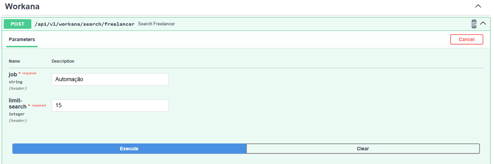
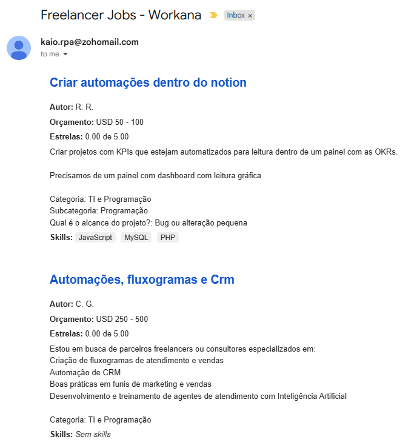

# Freelancer Scout

**Freelancer Scout** is a FastAPI application that allows you to search for freelancers on Workana and receive the results via email.

## Features

- Search freelancers on Workana by predefined criteria.
- Returns a JSON response with job details including title, description, author, budget, rating, skills, and link.
- Automatically sends the results to a specified email address using Zoho Mail as the SMTP server.

## API Endpoint



### Search Freelancers

**Response Example:**

```json
{
  "quantity_jobs": 5,
  "jobs": [
    {
      "title": "Criar automações dentro do notion",
      "about": "Criar projetos com KPIs que estejam automatizados para leitura dentro de um painel com as OKRs.\n\nPrecisamos de um painel com dashboard com leitura gráfica\n\nCategoria: TI e Programação\nSubcategoria: Programação\nQual é o alcance do projeto?: Bug ou alteração pequena",
      "author": "R. R.",
      "budget": "USD 50 - 100",
      "stars": "0.00 de 5.00",
      "skills": ["JavaScript", "MySQL", "PHP"],
      "link": "https://www.workana.com/job/criar-automacoes-dentro-do-notion?ref=projects_1"
    },
    {
      "title": "Automações, fluxogramas e Crm",
      "about": "Estou em busca de parceiros freelancers ou consultores especializados em:\nCriação de fluxogramas de atendimento e vendas\nAutomação de CRM\nBoas práticas em funis de marketing e vendas\nDesenvolvimento e treinamento de agentes de atendimento com Inteligência Artificial\n\nCategoria: TI e Programação",
      "author": "C. G.",
      "budget": "USD 250 - 500",
      "stars": "0.00 de 5.00",
      "skills": [],
      "link": "https://www.workana.com/job/automacoes-fluxogramas-e-crm?ref=projects_1"
    }
  ]
}
```

### Installation

- git clone https://github.com/Kaio1394/Freelance-Scout
- cd freelancer-scout
- pip install -r requirements.txt
- .\start.ps1

### Email body example:

